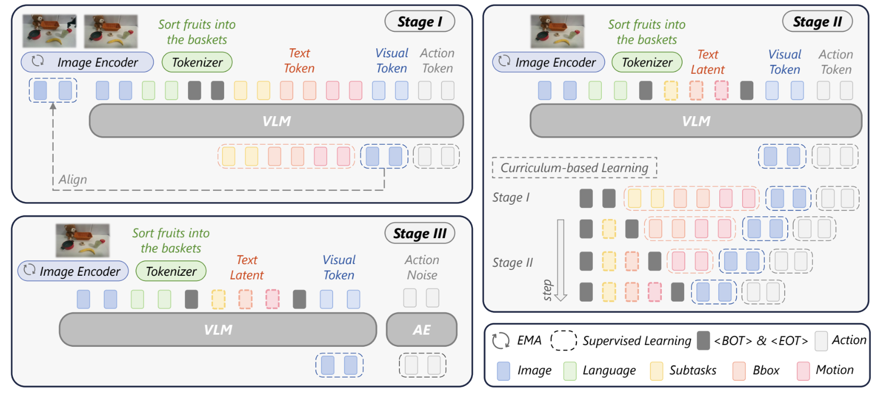

<h1 align="center">[ICML 2026] LaRA-VLA</h1>

<p align="center">
  <strong>Latent Reasoning VLA: Latent Thinking and Prediction for Vision-Language-Action Models</strong>
</p>

<p align="center">
  <a href="https://baishuanghao.github.io/">Shuanghao Bai*</a>, <a href="https://scholar.google.com/citations?hl=vi&user=Th6JWCEAAAAJ">Jing Lyu*</a>, <a href="https://ellezwq.github.io/">Wanqi Zhou</a>, <a href="https://scholar.google.com/citations?user=U8f81zQAAAAJ&hl=zh-CN">Zhe Li</a>, <a href="">Dakai Wang</a>, <a href="https://scholar.google.com/citations?user=TlfrTOkAAAAJ&hl=en">Lei Xing</a>, <a href="https://people.ucas.ac.cn/~zhaoxiaoguang?language=en">Xiaoguang Zhao</a>, <a href="https://scholar.google.com/citations?hl=zh-CN&user=2xR6P5AAAAAJ">Pengwei Wang</a>, <a href="https://www.wangzhongyuan.com/">Zhongyuan Wang</a>, <a href="https://chicheng123.github.io/">Cheng Chi</a>, <a href="https://gr.xjtu.edu.cn/web/chenbd/home">Badong Chen</a>, <a href="https://pku-hmi-lab.github.io/HMI-Web/leader.html">Shanghang Zhang</a>
</p>


<p align="center">
  <a href="https://loveju1y.github.io/Latent-Reasoning-VLA/">
    
  </a>
  <a href="https://arxiv.org/abs/2602.01166">
    
  </a>
  <a href="https://github.com/LoveJu1y/LaRA-VLA">
    
  </a>
  <a href="./LICENSE">
    
  </a>
</p>

<p align="center">
  
</p>

<p align="center">
  <sub>
    LaRA-VLA performs iterative latent reasoning by feeding hidden states back into reasoning slots
    before action prediction, rather than relying on long explicit chain-of-thought generation.
  </sub>
</p>

## Method Overview

This repository builds on the open-source StarVLA codebase and focuses on
**implicit latent reasoning** for VLA policy learning. The active code
namespace in this repository is `laravla/`.

## NEWS
- 🎉 LaRA-VLA has been accepted to **[ICML 2026](https://icml.cc/Conferences/2026)**.
- ✅ Training code is released.
- ✅ Evaluation code is released.
- ⏳ Pretrained model weights are not released yet.
- ⏳ Training datasets are not released yet.

## Installation

```bash
git clone https://github.com/LoveJu1y/LaRA-VLA
cd LaRA-VLA

conda create -n lara-vla python=3.10 -y
conda activate lara-vla

pip install -r requirements.txt
pip install -e .
```


## Quick Start

### 1) Basic check

```bash
python -c "from laravla.training.train import main; print('OK')"
```

### 2) Multi-stage training for VLM 

Bridge:

```bash
bash scripts/run_bridge_multistage.sh
```

LIBERO:

```bash
bash scripts/run_libero_multistage.sh
```

### 3) Single-stage training for VLA

Bridge:

```bash
bash scripts/run_laravla_bridge.sh
```

LIBERO:

```bash
bash scripts/run_laravla_libero.sh
```


## Evaluation

### LIBERO

The LIBERO results above correspond to the evaluation workflow documented in
[examples/LIBERO/README.md](examples/LIBERO/README.md).

#### Results

| CoT Type | Method | Spatial | Goal | Object | Long | Avg |
| --- | --- | ---: | ---: | ---: | ---: | ---: |
| No CoT | OpenVLA (Kim et al., 2025b) | 84.7 | 88.4 | 79.2 | 53.7 | 76.5 |
|  | π₀ (Black et al., 2024) | 96.8 | 98.8 | 95.8 | 85.2 | 94.2 |
|  | OpenVLA-OFT (Kim et al., 2025a) | 97.6 | 98.4 | 97.9 | 94.5 | 97.1 |
| Textual CoT | ThinkAct (Huang et al., 2025) | 88.3 | 91.4 | 87.1 | 70.9 | 84.4 |
|  | MolmoAct (Lee et al., 2025) | 87.0 | 95.4 | 87.6 | 77.2 | 86.6 |
|  | π₀.₅ (Intelligence et al., 2025) | 98.8 | 98.2 | 98.0 | 92.4 | 96.8 |
|  | DeepThinkVLA (Yin et al., 2025) | 99.0 | 96.6 | 96.4 | 96.2 | 97.0 |
| Visual CoT | CoT-VLA (Zhao et al., 2025) | 87.5 | 91.6 | 87.6 | 69.0 | 81.1 |
|  | DreamVLA (Zhang et al., 2025b) | 97.5 | 94.0 | 89.5 | 89.5 | 92.6 |
|  | F1 (Lv et al., 2025) | 98.2 | 97.8 | 95.4 | 91.3 | 95.7 |
|  | UD-VLA (Chen et al., 2025b) | 94.1 | 95.7 | 91.2 | 89.6 | 92.7 |
| Latent CoT | Fast-ThinkAct (Huang et al., 2026) | 92.0 | 97.2 | 90.2 | 79.4 | 89.7 |
|  | **LaRA-VLA (Ours)** | 96.4 | 98.6 | 99.8 | 96.6 | **97.9** |
### SimplerEnv

The Bridge real-world results above are evaluated through the SimplerEnv-based
pipeline documented in
[examples/SimplerEnv/README.md](examples/SimplerEnv/README.md).

#### Results

| CoT Type | Method | Put Spoon | Put Carrot | Stack Block | Put Eggplant | Avg |
| --- | --- | ---: | ---: | ---: | ---: | ---: |
| No CoT | OpenVLA (Kim et al., 2025b) | 0.0 | 0.0 | 0.0 | 4.1 | 1.0 |
|  | Octo (Ghosh et al., 2024) | 47.2 | 9.7 | 4.2 | 56.9 | 29.5 |
|  | OpenVLA-OFT (Kim et al., 2025a) | 12.5 | 4.2 | 8.3 | 37.5 | 39.6 |
|  | π₀ (Black et al., 2024) | 29.1 | 0.0 | 16.7 | 62.5 | 40.1 |
|  | CogACT (Li et al., 2024) | 71.7 | 50.8 | 15.0 | 67.5 | 51.3 |
| Textual CoT | ThinkAct (Huang et al., 2025) | 58.3 | 37.5 | 8.7 | 70.8 | 43.8 |
| Visual CoT | F1 (Lv et al., 2025) | 50.0 | 70.8 | 50.0 | 66.7 | 59.4 |
|  | UD-VLA (Chen et al., 2025b) | 58.3 | 62.5 | 54.1 | 75.0 | 62.5 |
| Latent CoT | **LaRA-VLA (Ours)** | 95.8 | 62.5 | 25.0 | 91.7 | **68.8** |

## Acknowledgments

Our code builds on the open-source [StarVLA](https://github.com/starVLA/starVLA) codebase, and incorporates ideas and components from [Coconut](https://github.com/facebookresearch/coconut) and [ECOT (Embodied Chain-of-Thought)](https://github.com/MichalZawalski/embodied-CoT).

## Citation

```bibtex
@article{bai2026latentreasoningvla,
  title={Latent Reasoning VLA: Latent Thinking and Prediction for Vision-Language-Action Models},
  author={Bai, Shuanghao and Lyu, Jing and Zhou, Wanqi and Li, Zhe and Wang, Dakai and Xing, Lei and Zhao, Xiaoguang and Wang, Pengwei and Wang, Zhongyuan and Chi, Cheng and Chen, Badong and Zhang, Shanghang},
  journal={arXiv preprint arXiv:2602.01166},
  year={2026}
}
```

## License

Released under the MIT License. See `LICENSE`.
